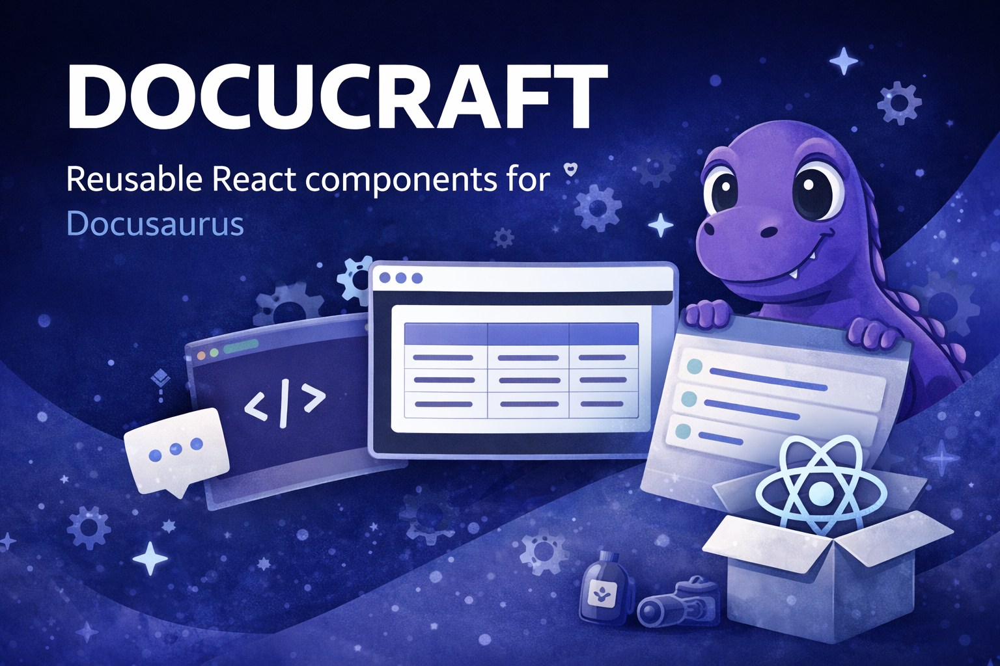

# Docucraft



Docucraft is an open-source React component library for technical documentation built with Docusaurus.

It provides reusable, typed, documentation-first components for diagrams, repository maps, and architecture explanations. The goal is simple: keep docs readable for humans while still making complex systems explorable.

## What You Get

- `MermaidDiagram` - a Docusaurus Mermaid wrapper with zoom, pan, fullscreen, SVG export, and PNG export.
- `ClassDiagram` - an interactive DTO/class relationship graph with focus, full, and inline modes.
- `RepositoryExplorer` - a compact repository tree with file/folder icons, a detail panel, and optional relation graph.

Docucraft is designed for docs that need more than static Markdown, but should still be easy to maintain as data.

## Installation

```bash
npm install docucraft
```

Docucraft expects React and Docusaurus in the consuming project.

```bash
npm install react react-dom @docusaurus/core @docusaurus/theme-mermaid
```

Most Docusaurus projects already have these installed. `@docusaurus/theme-mermaid` is required when using `MermaidDiagram`.

## Docusaurus Setup

Enable Mermaid support in `docusaurus.config.ts`:

```ts
export default {
  markdown: {
    mermaid: true,
  },
  themes: ['@docusaurus/theme-mermaid'],
};
```

Then import components directly in Markdown/MDX pages:

```mdx
import {ClassDiagram, MermaidDiagram, RepositoryExplorer} from 'docucraft';
```

## Quick Start

```mdx
import {MermaidDiagram} from 'docucraft';

<MermaidDiagram
  definition={String.raw`flowchart LR
    ROS[ROS topic] --> Handler[Stream handler] --> TE[TerraExplorer]
  `}
  ariaLabel="ROS stream flow"
/>
```

```mdx
import {ClassDiagram} from 'docucraft';

<ClassDiagram
  mode="focus"
  focus="order"
  data={{
    classes: [
      {
        id: 'order',
        name: 'OrderDto',
        kind: 'record',
        summary: 'Order data transferred from the API.',
        properties: [
          {name: 'id', typeLabel: 'string', isPrimitive: true, isRequired: true},
          {name: 'customer', typeLabel: 'CustomerDto', typeId: 'customer'},
        ],
      },
      {
        id: 'customer',
        name: 'CustomerDto',
        properties: [{name: 'name', typeLabel: 'string', isPrimitive: true}],
      },
    ],
  }}
/>
```

```mdx
import {RepositoryExplorer} from 'docucraft';

<RepositoryExplorer
  initialExpandedDepth={2}
  sections={[
    {
      title: 'Application',
      description: 'Main application source tree.',
      root: {
        name: 'src',
        type: 'folder',
        path: 'src/',
        shortDescription: 'Application source code.',
        longDescription: 'Runtime implementation and public contracts.',
        children: [
          {
            name: 'IClient.ts',
            type: 'file',
            kind: 'interface',
            path: 'src/IClient.ts',
            shortDescription: 'Client contract.',
            relations: [
              {target: 'src/Client.ts', label: 'implemented by', type: 'implements'},
            ],
          },
          {
            name: 'Client.ts',
            type: 'file',
            kind: 'implementation',
            path: 'src/Client.ts',
            shortDescription: 'Client implementation.',
          },
        ],
      },
    },
  ]}
/>
```

## Import Paths

Use the package root for normal usage:

```ts
import {MermaidDiagram, ClassDiagram, RepositoryExplorer} from 'docucraft';
```

Subpath imports are also available:

```ts
import MermaidDiagram from 'docucraft/mermaid';
import ClassDiagram from 'docucraft/class-diagram';
import RepositoryExplorer from 'docucraft/repository-explorer';
```

## Components

### MermaidDiagram

`MermaidDiagram` renders Mermaid source through Docusaurus and adds documentation-friendly interactions.

Props:

- `definition: string` - Mermaid source code.
- `className?: string` - additional class on the root wrapper.
- `ariaLabel?: string` - accessible label for the diagram viewport.
- `minScale?: number` - minimum zoom, default `0.6`.
- `maxScale?: number` - maximum zoom, default `4`.
- `zoomStep?: number` - zoom increment, default `0.12`.
- `showHint?: boolean` - show or hide the hint row, default `true`.
- `hintText?: string` - custom hint text.
- `exportFileName?: string` - export file prefix, default `diagram`.
- `enableFullscreen?: boolean` - show fullscreen action, default `true`.
- `enableExport?: boolean` - show export actions, default `true`.

### ClassDiagram

`ClassDiagram` renders typed class, DTO, record, and enum graphs from plain data.

Props:

- `data: ClassDiagramModel` - graph model.
- `focus?: string` - initially focused class id.
- `mode?: 'focus' | 'full' | 'inline'` - rendering mode, default `focus`.
- `height?: number` - canvas height in pixels, default `620`.
- `maxDepth?: number` - relationship expansion depth in focus mode, default `1`.
- `showPrimitives?: boolean` - include primitive-only properties, default `true`.
- `className?: string` - additional class on the root wrapper.

Model shape:

```ts
type ClassDiagramModel = {
  classes: DtoClass[];
};

type DtoClass = {
  id: string;
  name: string;
  namespace?: string;
  kind?: 'class' | 'record' | 'enum';
  baseTypeId?: string;
  summary?: string;
  properties: DtoProperty[];
};

type DtoProperty = {
  name: string;
  typeLabel: string;
  typeId?: string;
  isNullable?: boolean;
  isCollection?: boolean;
  isEnum?: boolean;
  isPrimitive?: boolean;
  isRequired?: boolean;
  summary?: string;
};
```

### RepositoryExplorer

`RepositoryExplorer` renders a compact, solution-explorer style tree. The tree stays intentionally dense; descriptions and relations live in the detail panel.

Props:

- `sections?: RepositorySection[]` - multiple repository sections, recommended for larger repositories.
- `root?: RepositoryNode` - one root tree, useful for small projects.
- `initialExpandedDepth?: number` - initial tree expansion depth, default `1`.
- `showSectionDescriptions?: boolean` - show section item counts/tooltips, default `true`.
- `labels?: Partial<RepositoryExplorerLabels>` - override built-in UI labels for localization.

Node shape:

```ts
type RepositoryNode = {
  id?: string;
  name: string;
  type: 'folder' | 'file';
  kind?: RepositoryNodeKind;
  shortDescription: string;
  longDescription?: string;
  path?: string;
  children?: RepositoryNode[];
  relations?: RepositoryRelation[];
  defaultExpanded?: boolean;
};
```

Use `path` when possible. Relation targets can resolve by `id`, `path`, normalized `path` without a trailing slash, or `name`.

Relation shape:

```ts
type RepositoryRelation = {
  target: string;
  label: string;
  type?: RepositoryRelationType;
  description?: string;
  external?: boolean;
};

type RepositoryRelationType =
  | 'implements'
  | 'calls'
  | 'depends-on'
  | 'uses'
  | 'publishes'
  | 'reads'
  | 'hosts'
  | 'configures'
  | 'tests';
```

Common node kinds:

```ts
type RepositoryNodeKind =
  | 'folder'
  | 'file'
  | 'interface'
  | 'implementation'
  | 'code'
  | 'dto'
  | 'json'
  | 'xml'
  | 'yaml'
  | 'text'
  | 'markdown'
  | 'image'
  | 'video'
  | 'audio'
  | 'pgm'
  | 'rosMsg'
  | 'config'
  | 'dependency'
  | 'test'
  | 'asset'
  | 'docs'
  | 'script'
  | 'package'
  | 'project'
  | 'solution'
  | 'lock'
  | 'database'
  | 'archive';
```

Localization example:

```tsx
<RepositoryExplorer
  sections={sections}
  labels={{
    relationsTitle: 'Relations',
    noRelations: 'No relations described.',
    emptySelection: 'Select a file or folder.',
    graphFallback: 'The relation graph loads in the browser.',
    expandNode: (name) => `Expand ${name}`,
    collapseNode: (name) => `Collapse ${name}`,
    sectionItemCount: (count) => `${count} items`,
  }}
/>
```

## Project Structure

```text
src/
  index.ts
  components/
    ClassDiagram/
      index.tsx
      styles.module.css
    MermaidDiagram/
      index.tsx
      styles.module.css
    RepositoryExplorer/
      index.tsx
      RepositoryIcon.tsx
      styles.module.css
      exampleData.ts
      README.md
```

Conventions:

- Every component lives in `src/components/<ComponentName>/`.
- Public exports are centralized in `src/index.ts`.
- CSS modules are copied into `dist` during build.
- Consumers should import from package entrypoints, not from `dist/...` deep paths.

## Development

```bash
npm install
npm run typecheck
npm run build
npm run pack:check
```

Build output is written to `dist/`.

## Adding a Component

1. Create `src/components/YourComponent/`.
2. Add `index.tsx` and, if needed, `styles.module.css`.
3. Export the component and its public types from `src/index.ts`.
4. Add a package subpath export in `package.json` if direct imports should be supported.
5. Update this README with the component purpose, props, and an example.
6. Run the full prepublish checks.

## Prepublish Checklist

Before publishing to npm or pushing a release tag to GitHub:

```bash
npm run typecheck
npm run build
npm run pack:check
git diff --check
git status --short
```

Also verify:

- `package.json` version is new and matches the intended release.
- `CHANGELOG.md` describes the release.
- `README.md` documents new public API.
- `npm pack --dry-run` includes the expected files only.
- No generated tarball or local test artifact is committed.

Publish:

```bash
npm login
npm publish --access public
git tag vX.Y.Z
git push origin main --tags
```

## License

MIT. See [LICENSE](./LICENSE).

Copyright (c) Jiří Šašek.
