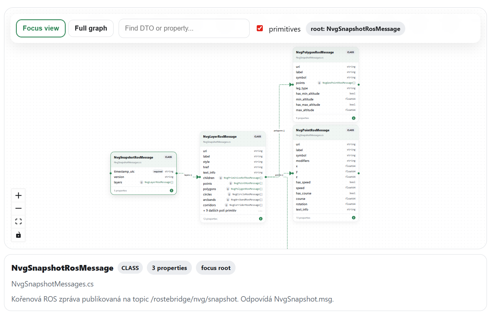

# ClassDiagram

Renders typed class, DTO, record, and enum relationship graphs from plain data objects. Supports focus, full, and inline display modes with interactive navigation between related types.



---

## Quick Start

```mdx
import {ClassDiagram} from 'docucraft';

<ClassDiagram
  mode="focus"
  focus="order"
  data={{
    classes: [
      {
        id: 'order',
        name: 'OrderDto',
        kind: 'record',
        summary: 'Order data transferred from the API.',
        properties: [
          {name: 'id',       typeLabel: 'string',      isPrimitive: true, isRequired: true},
          {name: 'customer', typeLabel: 'CustomerDto',  typeId: 'customer'},
        ],
      },
      {
        id: 'customer',
        name: 'CustomerDto',
        properties: [
          {name: 'name', typeLabel: 'string', isPrimitive: true},
        ],
      },
    ],
  }}
/>
```

---

## Props

| Prop | Type | Default | Description |
|------|------|---------|-------------|
| `data` | `ClassDiagramModel` | — | The full class model. |
| `focus` | `string` | — | `id` of the class to show initially in focus mode. |
| `mode` | `'focus' \| 'full' \| 'inline'` | `'focus'` | How the graph is displayed. |
| `height` | `number` | `620` | Canvas height in pixels. |
| `maxDepth` | `number` | `1` | How many hops away from the focused class to show. |
| `showPrimitives` | `boolean` | `true` | Whether to include properties with primitive types. |
| `className` | `string` | — | Additional CSS class on the root wrapper. |

---

## Modes

**`focus`** — starts with one class visible. Readers navigate by clicking on type names to re-focus. Use this for large models or when you want to guide the reader to a specific entry point. Set `focus` to the `id` of the starting class.

**`full`** — renders all classes in the model at once in a single auto-laid-out graph. Use for small models (up to ~10 classes) where the full picture is the point.

**`inline`** — compact single-class view without the graph canvas. Suitable for embedding a class definition inside prose.

---

## ClassDiagramModel — Field Reference

The top-level model is just an array of classes:

```ts
type ClassDiagramModel = {
  classes: DtoClass[];
};
```

All classes in the model must be present in `classes`, even those that are only referenced from other classes via `typeId`. The graph is built from this flat list — the component resolves connections at render time.

---

## DtoClass — Field Reference

Each class, record, or enum in the diagram is a `DtoClass`.

```ts
type DtoClass = {
  id: string;
  name: string;
  namespace?: string;
  kind?: 'class' | 'record' | 'enum';
  baseTypeId?: string;
  summary?: string;
  properties: DtoProperty[];
};
```

### `id` — unique identifier

Used internally to wire up relations. Every `typeId` on properties and every `baseTypeId` must match a `id` of another class in the model. Use a short, lowercase, stable slug.

```ts
id: 'order'
id: 'customer'
id: 'payment-method'
```

### `name` — display name

The class name as it appears in the graph node header.

```ts
name: 'OrderDto'
name: 'CustomerDto'
name: 'PaymentMethod'
```

### `namespace` — optional namespace or module path

Shown below the class name in smaller text. Useful for large models where multiple classes share the same name across namespaces.

```ts
namespace: 'MyApp.Orders'
namespace: 'MyApp.Payments'
```

### `kind` — class, record, or enum

Shown as a badge in the node header. Affects how the node is styled.

| Kind | Use for |
|------|---------|
| `class` | Standard mutable class |
| `record` | Immutable record / value object |
| `enum` | Enumeration type |

Omit when the distinction does not matter in your documentation.

### `baseTypeId` — inheritance

Set to the `id` of the parent class. The graph will draw an inheritance edge from this class to its base.

```ts
baseTypeId: 'base-entity'
```

### `summary` — description of the class

Shown in the node as a subtitle. Keep it under 100 characters.

```ts
summary: 'Represents a customer order in the API contract.'
```

### `properties` — list of properties

See [DtoProperty field reference](#dtoproperty--field-reference) below.

---

## DtoProperty — Field Reference

Each property on a class is a `DtoProperty`.

```ts
type DtoProperty = {
  name: string;
  typeLabel: string;
  typeId?: string;
  isNullable?: boolean;
  isCollection?: boolean;
  isEnum?: boolean;
  isPrimitive?: boolean;
  isRequired?: boolean;
  summary?: string;
};
```

### `name` — property name

```ts
name: 'id'
name: 'customerId'
name: 'items'
```

### `typeLabel` — type shown in the graph

Exactly what appears in the type column. Write it as you would in code.

```ts
typeLabel: 'string'
typeLabel: 'int'
typeLabel: 'CustomerDto'
typeLabel: 'List<OrderItemDto>'
```

### `typeId` — links this property to another class

Set `typeId` to the `id` of the target class. This creates a clickable link in focus mode — readers can click the property type to navigate to the related class.

```ts
{name: 'customer', typeLabel: 'CustomerDto', typeId: 'customer'}
```

Leave `typeId` unset for primitive types and for types that are not in the model.

### `isPrimitive` — marks as a primitive type

Primitives (`string`, `int`, `bool`, `DateTime`, etc.) are rendered without a relation edge. Set this to prevent the component from trying to resolve a link.

```ts
{name: 'id', typeLabel: 'string', isPrimitive: true}
```

### `isNullable` — marks the property as nullable

Appends `?` to the type label in the graph.

```ts
{name: 'cancelledAt', typeLabel: 'DateTime', isPrimitive: true, isNullable: true}
```

### `isCollection` — marks as a list or array

Appends `[]` to the type label in the graph.

```ts
{name: 'items', typeLabel: 'OrderItemDto', typeId: 'order-item', isCollection: true}
```

### `isRequired` — marks the property as required

Shown as a visual indicator (bold or marker) in the graph.

```ts
{name: 'id', typeLabel: 'string', isPrimitive: true, isRequired: true}
```

### `isEnum` — marks the type as an enum

Use when the property's type is an enum that is not in the model (e.g. a primitive-like enum imported from another assembly).

### `summary` — property description

Shown as a tooltip or in the detail panel, depending on the rendering mode.

```ts
summary: 'ISO 4217 currency code.'
```

---

## Mapping Your Classes — Step by Step

**1. Identify the classes you want to document.**  
Pick the classes that readers need to understand — typically DTOs, request/response models, entities, or domain objects. You do not need to include every class; focus on the ones that have relations.

**2. Assign each class a stable `id`.**  
Use a short, lowercase slug that matches the class name. Avoid spaces and dots.

```ts
{id: 'order',    name: 'OrderDto'}
{id: 'customer', name: 'CustomerDto'}
{id: 'item',     name: 'OrderItemDto'}
```

**3. List properties for each class.**  
For primitive properties (`string`, `int`, `bool`, `DateTime`), set `isPrimitive: true`. For properties whose type is another class in the model, set `typeId` to that class's `id`.

```ts
properties: [
  {name: 'id',         typeLabel: 'Guid',        isPrimitive: true, isRequired: true},
  {name: 'status',     typeLabel: 'OrderStatus',  isEnum: true},
  {name: 'customer',   typeLabel: 'CustomerDto',  typeId: 'customer'},
  {name: 'items',      typeLabel: 'OrderItemDto', typeId: 'item', isCollection: true},
  {name: 'cancelledAt',typeLabel: 'DateTime',     isPrimitive: true, isNullable: true},
]
```

**4. Add inheritance where relevant.**  
If `OrderDto` extends `BaseEntityDto`, add `BaseEntityDto` to the model and set `baseTypeId: 'base-entity'` on `OrderDto`.

**5. Choose the display mode.**  
Use `mode="focus"` with `focus="order"` to start on the `OrderDto` class. Use `mode="full"` if the model is small and you want to show everything at once.

---

## Complete Example

```mdx
import {ClassDiagram} from 'docucraft';

<ClassDiagram
  mode="focus"
  focus="order"
  height={700}
  data={{
    classes: [
      {
        id: 'order',
        name: 'OrderDto',
        kind: 'record',
        summary: 'Complete order as returned by the API.',
        properties: [
          {name: 'id',          typeLabel: 'Guid',          isPrimitive: true,  isRequired: true},
          {name: 'status',      typeLabel: 'OrderStatus',   isEnum: true},
          {name: 'customer',    typeLabel: 'CustomerDto',   typeId: 'customer'},
          {name: 'items',       typeLabel: 'OrderItemDto',  typeId: 'item',     isCollection: true},
          {name: 'createdAt',   typeLabel: 'DateTime',      isPrimitive: true},
          {name: 'cancelledAt', typeLabel: 'DateTime',      isPrimitive: true,  isNullable: true},
        ],
      },
      {
        id: 'customer',
        name: 'CustomerDto',
        kind: 'record',
        summary: 'Customer snapshot embedded in the order.',
        properties: [
          {name: 'id',    typeLabel: 'Guid',   isPrimitive: true, isRequired: true},
          {name: 'name',  typeLabel: 'string', isPrimitive: true},
          {name: 'email', typeLabel: 'string', isPrimitive: true},
        ],
      },
      {
        id: 'item',
        name: 'OrderItemDto',
        kind: 'record',
        properties: [
          {name: 'productId', typeLabel: 'Guid',    isPrimitive: true, isRequired: true},
          {name: 'quantity',  typeLabel: 'int',     isPrimitive: true},
          {name: 'unitPrice', typeLabel: 'decimal', isPrimitive: true},
        ],
      },
    ],
  }}
/>
```

---

## Tips

- **Every class referenced via `typeId` must be in `classes`.** A missing `typeId` target is silently ignored.
- **Use `showPrimitives={false}`** when the graph is too noisy. This hides all primitive-only properties and shows only the typed relations.
- **Use `maxDepth={2}`** in focus mode to show two hops instead of one when the model has deeply nested relations.
- **Split large models across multiple `ClassDiagram` instances** on the same page, each focused on a different subsystem.

---

## Subpath Import

```ts
import ClassDiagram from 'docucraft/class-diagram';
```
