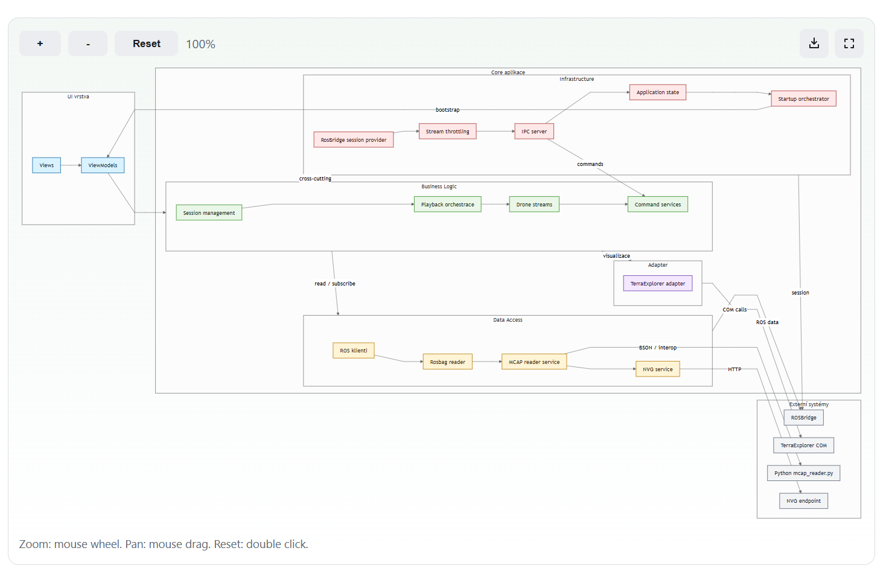

# MermaidDiagram

Renders Mermaid source through Docusaurus and adds documentation-friendly interactions: zoom, pan, fullscreen, SVG export, and PNG export.



---

## Quick Start

```mdx
import {MermaidDiagram} from 'docucraft';

<MermaidDiagram
  definition={String.raw`flowchart LR
    API --> Service --> Database
  `}
  ariaLabel="Service layer overview"
/>
```

---

## Requirements

`@docusaurus/theme-mermaid` must be installed and enabled. Most Docusaurus projects already have it.

```bash
npm install @docusaurus/theme-mermaid
```

```ts
// docusaurus.config.ts
export default {
  markdown: {mermaid: true},
  themes: ['@docusaurus/theme-mermaid'],
};
```

`MermaidDiagram` wraps the native Docusaurus `<Mermaid>` component and adds the interactive layer on top — so any diagram type Docusaurus supports works here.

---

## Props

| Prop | Type | Default | Description |
|------|------|---------|-------------|
| `definition` | `string` | — | Mermaid source code. |
| `ariaLabel` | `string` | — | Accessible label for the diagram viewport. Describe what the diagram shows. |
| `className` | `string` | — | Additional CSS class on the root wrapper. |
| `minScale` | `number` | `0.6` | Minimum zoom level. `1` means no zoom out at all. |
| `maxScale` | `number` | `4` | Maximum zoom level. |
| `zoomStep` | `number` | `0.12` | Zoom increment per scroll step or button click. |
| `showHint` | `boolean` | `true` | Show or hide the usage hint row below the diagram. |
| `hintText` | `string` | — | Custom hint text to replace the default. |
| `exportFileName` | `string` | `"diagram"` | File name prefix used when exporting (`diagram.svg`, `diagram.png`). |
| `enableFullscreen` | `boolean` | `true` | Show the fullscreen button. |
| `enableExport` | `boolean` | `true` | Show the SVG and PNG export buttons. |

---

## Writing the Mermaid Definition

### Use `String.raw` to avoid escaping

Mermaid syntax uses backslashes in some contexts. Always wrap the diagram in `String.raw` to pass the source string exactly as written, without JavaScript escape processing:

```tsx
definition={String.raw`
  sequenceDiagram
    Client->>Server: POST /orders
    Server-->>Client: 201 Created
`}
```

Without `String.raw`, characters like `\n` inside the string would be interpreted by JavaScript before reaching the Mermaid parser.

### Indentation does not matter

You can indent the diagram freely inside the template literal. Mermaid ignores leading whitespace.

---

## Diagram Types and Examples

### Flowchart — system flow, request pipeline, decision trees

```
flowchart LR
  Client -->|HTTP| Gateway
  Gateway -->|gRPC| OrderService
  OrderService -->|SQL| Database
  OrderService -->|Event| MessageBus
```

Use `LR` for left-to-right flow (horizontal pipelines), `TD` for top-down flow (hierarchy, call stacks).

### Sequence Diagram — API call flows, protocol exchanges

```
sequenceDiagram
  actor User
  User->>Frontend: Submit order
  Frontend->>API: POST /orders
  API->>OrderService: CreateOrder(dto)
  OrderService->>DB: INSERT
  DB-->>OrderService: OK
  OrderService-->>API: OrderId
  API-->>Frontend: 201 Created
  Frontend-->>User: Confirmation
```

### Class Diagram — type structure (for quick, non-interactive overviews)

```
classDiagram
  class OrderDto {
    +Guid id
    +string status
    +CustomerDto customer
  }
  class CustomerDto {
    +Guid id
    +string name
  }
  OrderDto --> CustomerDto
```

For interactive, data-driven class graphs use [`ClassDiagram`](../ClassDiagram/README.md) instead.

### State Diagram — order lifecycle, workflow states

```
stateDiagram-v2
  [*] --> Pending
  Pending --> Processing : payment confirmed
  Processing --> Shipped : warehouse dispatch
  Shipped --> Delivered : courier update
  Processing --> Cancelled : manual cancel
  Cancelled --> [*]
  Delivered --> [*]
```

### Entity Relationship Diagram — database schema

```
erDiagram
  ORDER {
    uuid id PK
    uuid customer_id FK
    string status
  }
  CUSTOMER {
    uuid id PK
    string name
    string email
  }
  ORDER_ITEM {
    uuid order_id FK
    uuid product_id FK
    int quantity
  }
  CUSTOMER ||--o{ ORDER : places
  ORDER ||--|{ ORDER_ITEM : contains
```

### Git Graph — branching strategy

```
gitGraph
  commit id: "init"
  branch develop
  checkout develop
  commit id: "feature A"
  commit id: "feature B"
  checkout main
  merge develop id: "release 1.0"
```

---

## Export Behaviour

**SVG export** — produces a vector file that can be scaled to any size. Inline styles are copied from the rendered SVG so the export matches the on-screen appearance.

**PNG export** — rasterises the SVG via `canvg`. The output resolution matches the diagram at the current zoom level. For high-resolution exports, zoom in before exporting.

Set `exportFileName` to control the downloaded file name:

```tsx
<MermaidDiagram
  definition={...}
  exportFileName="order-flow"
/>
// Downloads: order-flow.svg or order-flow.png
```

---

## Accessibility

Always provide a descriptive `ariaLabel`. It is used as the `aria-label` on the diagram viewport and is read by screen readers.

```tsx
ariaLabel="Flowchart showing the order processing pipeline from API gateway to database"
```

---

## Tips

- **Keep diagrams focused.** A diagram with 5–8 nodes is readable; 20+ nodes becomes noise. Split large flows into multiple diagrams.
- **Use `exportFileName`** to give exports a meaningful name, especially when a page has multiple diagrams.
- **Disable export with `enableExport={false}`** for decorative or illustrative diagrams where download makes no sense.
- **Set `showHint={false}`** when embedding in tight layouts where the hint row takes up too much space.
- **Use `minScale={1}`** to prevent readers from zooming out past the natural size on small diagrams.

---

## Subpath Import

```ts
import MermaidDiagram from 'docucraft/mermaid';
```
