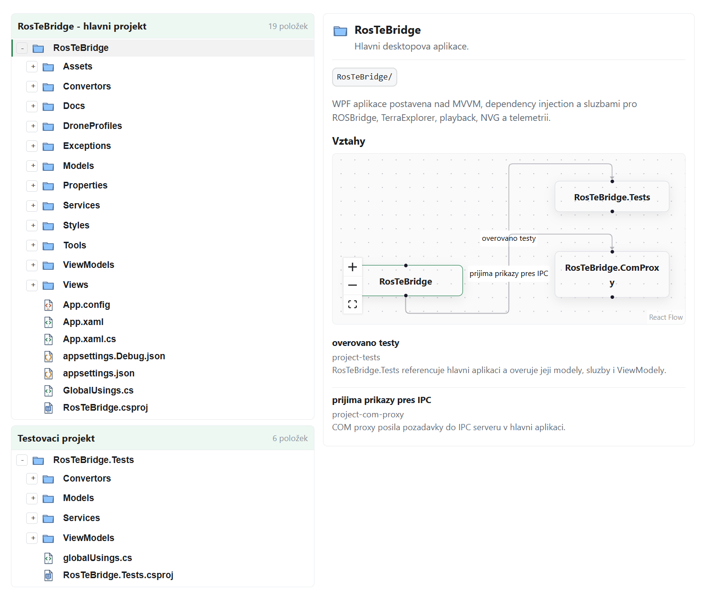

# RepositoryExplorer

A compact, interactive repository map for Docusaurus documentation. You describe your project's folder and file structure as data, and the component renders:

- a solution-explorer style tree with icons derived from file kind or extension,
- a detail panel for the selected node with short and long descriptions,
- an optional relation graph and relation list for each node.



---

## Quick Start

```mdx
import {RepositoryExplorer} from 'docucraft';

<RepositoryExplorer
  initialExpandedDepth={2}
  root={{
    name: 'src',
    type: 'folder',
    path: 'src/',
    shortDescription: 'Application source code.',
    children: [
      {
        name: 'index.ts',
        type: 'file',
        kind: 'code',
        path: 'src/index.ts',
        shortDescription: 'Public entry point.',
      },
    ],
  }}
/>
```

For a single small tree use `root`. For a multi-section repository use `sections` instead — see [sections vs root](#sections-vs-root).

---

## Props

| Prop | Type | Default | Description |
|------|------|---------|-------------|
| `root` | `RepositoryNode` | — | Single root tree. Use for small repositories. |
| `sections` | `RepositorySection[]` | — | Multiple named sections. Use for larger repositories. |
| `initialExpandedDepth` | `number` | `1` | How many levels of the tree are expanded on first render. |
| `showSectionDescriptions` | `boolean` | `true` | Show item counts and section tooltips. |
| `labels` | `Partial<RepositoryExplorerLabels>` | — | Override UI strings for localization. |

Provide either `root` or `sections`, not both.

---

## Sections vs Root

**`root`** is a shorthand for a single tree. It is equivalent to `sections` with one section and no title.

```tsx
// Simple: one tree, no header
<RepositoryExplorer root={myRootNode} />

// Structured: multiple labelled trees in a tabbed/grouped layout
<RepositoryExplorer sections={[backendSection, frontendSection, infraSection]} />
```

Use `sections` whenever your codebase has multiple top-level concerns (e.g. separate backend and frontend repositories, a monorepo with multiple packages, or a solution with multiple projects).

---

## RepositorySection

A section groups one tree under a named heading.

```ts
type RepositorySection = {
  title: string;        // Heading label, e.g. "Backend", "Frontend"
  description?: string; // Optional tooltip or subtitle shown next to the title
  root: RepositoryNode; // The root node of this section's tree
};
```

Example:

```ts
const backendSection: RepositorySection = {
  title: 'Backend',
  description: 'ASP.NET Core service',
  root: {
    name: 'Backend',
    type: 'folder',
    path: 'backend/',
    shortDescription: 'Server-side application.',
    children: [ /* ... */ ],
  },
};
```

---

## RepositoryNode — Field Reference

Every item in the tree (folder or file) is a `RepositoryNode`.

```ts
type RepositoryNode = {
  id?: string;
  name: string;
  type: 'folder' | 'file';
  kind?: RepositoryNodeKind;
  shortDescription: string;
  longDescription?: string;
  path?: string;
  children?: RepositoryNode[];
  relations?: RepositoryRelation[];
  defaultExpanded?: boolean;
};
```

### `name` — display name in the tree

The label shown next to the icon. Use the real file or folder name.

```ts
name: 'OrderService.ts'
name: 'src'
```

### `type` — `'folder'` or `'file'`

Controls whether the node can be expanded and which base icon is used when `kind` is not set.

### `kind` — icon and semantic category

Determines the SVG icon rendered in the tree. When omitted, the component falls back to the file extension (`.ts` → code icon, `.json` → json icon, etc.) or the generic file/folder icon.

| Kind | Use for |
|------|---------|
| `folder` | Generic folder (default when `type: 'folder'`) |
| `file` | Generic file (default when `type: 'file'`) |
| `interface` | TypeScript/C# interfaces, abstract contracts |
| `implementation` | Concrete class implementing an interface |
| `code` | General source files |
| `dto` | Data transfer objects, models, schemas |
| `json` | JSON files |
| `xml` | XML files |
| `yaml` | YAML/YML files |
| `text` | Plain text files |
| `markdown` | Markdown documentation files |
| `image` | Image assets |
| `video` | Video assets |
| `audio` | Audio assets |
| `pgm` | PGM image files |
| `rosMsg` | ROS message definitions |
| `config` | Configuration files (non-JSON/YAML) |
| `source` | Low-level source (C/C++, shaders, etc.) |
| `dependency` | Package manifests, lock files |
| `test` | Test files and test suites |
| `asset` | General binary assets |
| `docs` | Documentation folders or files |
| `script` | Shell scripts, build scripts |
| `package` | npm/NuGet/pip package roots |
| `project` | Project files (`.csproj`, `.sln`, etc.) |
| `solution` | Solution root or workspace root |
| `lock` | Lock files (`package-lock.json`, `yarn.lock`) |
| `database` | Database schemas, migration scripts |
| `archive` | Archives, build artifacts |

### `shortDescription` — one-line summary

Shown below the node name in the detail panel header, and as a tooltip. Keep it under 120 characters. This field is required.

### `longDescription` — extended description in the detail panel

Rendered as body text in the detail panel when the node is selected. Supports plain text. Use it for architecture notes, ownership info, or anything that does not fit in one line.

```ts
longDescription: `Handles all outbound HTTP communication. 
Uses typed clients registered via IHttpClientFactory. 
Do not instantiate directly — resolve from DI.`
```

### `path` — canonical path in the repository

The path as it appears in the repository. Used by other nodes to target this node in relations. Set it consistently and it becomes a stable, readable reference.

```ts
path: 'src/services/OrderService.ts'
path: 'src/services/'   // folders usually get a trailing slash
```

### `id` — optional custom identifier

When `path` would be awkward or when you want a stable short name for targeting in relations, set `id` explicitly.

```ts
id: 'order-service'
```

Relation targets resolve in this priority order: `id` → `path` (exact) → `path` (without trailing slash) → `name`.

### `children` — nested nodes

Array of child `RepositoryNode` items. Only meaningful on folder nodes.

### `defaultExpanded` — override initial expansion

When `true`, this node starts expanded regardless of `initialExpandedDepth`. When `false`, it starts collapsed even if depth would expand it. Omit to follow `initialExpandedDepth`.

```ts
defaultExpanded: true  // always start open
```

---

## RepositoryRelation — Field Reference

Relations are connections from one node to another. They appear in the detail panel as a list and optionally as a graph.

```ts
type RepositoryRelation = {
  target: string;
  label: string;
  type?: RepositoryRelationType;
  description?: string;
  external?: boolean;
};
```

### `target` — the node this relation points to

Can be:
- the `id` of another node: `'order-service'`
- the `path` of another node: `'src/services/OrderService.ts'`
- the `name` of another node (least precise, avoid for large trees): `'OrderService.ts'`

### `label` — short edge label

Describe the relationship from the source node's perspective. Keep it short (2-4 words).

```ts
label: 'implemented by'
label: 'depends on'
label: 'calls'
```

### `type` — semantic relation type (affects the graph edge style)

| Type | Use when |
|------|----------|
| `implements` | This node implements an interface |
| `calls` | This node calls another service or function |
| `depends-on` | General compile-time or runtime dependency |
| `uses` | Loose usage (consumes, reads from) |
| `publishes` | This node publishes events or messages |
| `reads` | This node reads from a data source |
| `hosts` | This node hosts or serves another |
| `configures` | This node configures another component |
| `tests` | This node is a test for another node |

### `description` — optional longer note about the relation

Displayed in the detail panel below the label.

```ts
description: 'Uses the typed client pattern. Retry policy configured in Program.cs.'
```

### `external` — marks a relation to something outside the tree

Set `external: true` when the target is not a node in this tree (e.g. an external NuGet package, a third-party API). The target string is then displayed as a label, not resolved as a node reference.

```ts
{
  target: 'MassTransit',
  label: 'publishes via',
  type: 'uses',
  external: true,
}
```

---

## Mapping Your Codebase — Step by Step

The easiest approach is to work top-down: start with the sections, then fill in top-level folders, then go deeper only for the parts that matter to readers.

**1. Choose your sections.**  
Each major concern, repo, or sub-project becomes one section. A monorepo with `backend/`, `frontend/`, and `infra/` maps to three sections.

**2. Set up the root node for each section.**  
The root node is the top-level folder. Give it a meaningful `shortDescription` that tells readers what the section contains.

```ts
{
  name: 'backend',
  type: 'folder',
  path: 'backend/',
  shortDescription: 'ASP.NET Core REST API.',
}
```

**3. Add first-level children.**  
Open your IDE's file explorer and map the immediate children. Use `kind` for anything that has a specific icon. Skip auto-generated folders (`bin/`, `obj/`, `node_modules/`).

```ts
children: [
  {name: 'src',     type: 'folder', path: 'backend/src/',     shortDescription: 'Application source.'},
  {name: 'tests',   type: 'folder', path: 'backend/tests/',   shortDescription: 'Unit and integration tests.', kind: 'test'},
  {name: 'Dockerfile', type: 'file', path: 'backend/Dockerfile', shortDescription: 'Container image definition.', kind: 'config'},
]
```

**4. Go deeper only for important subtrees.**  
You do not need to map every file. Focus on the parts readers need to understand the architecture: the main service layer, the public API contracts, the data models.

**5. Add descriptions.**  
Fill `shortDescription` for every node you add. For the most important files, add `longDescription` with ownership or architecture notes.

**6. Add relations.**  
After the tree is complete, add relations to the nodes that have meaningful connections. Focus on cross-folder or cross-section relations — those are the ones readers cannot infer from the folder structure alone.

---

## Complete Example

```tsx
import {RepositoryExplorer, type RepositorySection} from 'docucraft';

const sections: RepositorySection[] = [
  {
    title: 'Backend',
    description: 'ASP.NET Core REST API',
    root: {
      name: 'Backend',
      type: 'folder',
      path: 'backend/',
      shortDescription: 'Server-side application.',
      children: [
        {
          name: 'Controllers',
          type: 'folder',
          path: 'backend/Controllers/',
          shortDescription: 'HTTP endpoints.',
          children: [
            {
              name: 'OrdersController.cs',
              type: 'file',
              kind: 'code',
              path: 'backend/Controllers/OrdersController.cs',
              shortDescription: 'CRUD operations for orders.',
              relations: [
                {target: 'backend/Services/OrderService.cs', label: 'delegates to', type: 'calls'},
              ],
            },
          ],
        },
        {
          name: 'Services',
          type: 'folder',
          path: 'backend/Services/',
          shortDescription: 'Business logic layer.',
          children: [
            {
              id: 'order-service',
              name: 'OrderService.cs',
              type: 'file',
              kind: 'implementation',
              path: 'backend/Services/OrderService.cs',
              shortDescription: 'Handles order lifecycle.',
              longDescription: 'Validates incoming orders, persists them via the repository, and publishes domain events to the message bus.',
              relations: [
                {target: 'backend/Contracts/IOrderRepository.cs', label: 'uses', type: 'depends-on'},
                {target: 'MassTransit', label: 'publishes via', type: 'publishes', external: true},
              ],
            },
          ],
        },
        {
          name: 'Contracts',
          type: 'folder',
          path: 'backend/Contracts/',
          shortDescription: 'Interfaces and DTOs.',
          children: [
            {
              name: 'IOrderRepository.cs',
              type: 'file',
              kind: 'interface',
              path: 'backend/Contracts/IOrderRepository.cs',
              shortDescription: 'Data access contract for orders.',
            },
          ],
        },
      ],
    },
  },
];

export default function ArchitecturePage() {
  return (
    <RepositoryExplorer
      sections={sections}
      initialExpandedDepth={2}
      labels={{
        relationsTitle: 'Relations',
        noRelations: 'No relations described.',
        emptySelection: 'Select a file or folder to see details.',
        graphFallback: 'The relation graph loads in the browser.',
        expandNode: (name) => `Expand ${name}`,
        collapseNode: (name) => `Collapse ${name}`,
        sectionItemCount: (count) => `${count} items`,
      }}
    />
  );
}
```

---

## Localization

Override any or all UI strings via `labels` to adapt the component to a different language:

```tsx
<RepositoryExplorer
  sections={sections}
  labels={{
    relationsTitle: 'Relations',
    noRelations: 'No relations described.',
    emptySelection: 'Select a file or folder.',
    graphFallback: 'The relation graph loads in the browser.',
    expandNode: (name) => `Expand ${name}`,
    collapseNode: (name) => `Collapse ${name}`,
    sectionItemCount: (count) => `${count} items`,
  }}
/>
```

---

## Tips

- **Always set `path`** on every node. It makes relation targeting unambiguous and future-proof.
- **Keep descriptions short.** `shortDescription` is a label, not a paragraph. Use `longDescription` for anything over one sentence.
- **Do not add every file.** A useful map shows architecture, not a file listing. Omit auto-generated files, lock files, and build artifacts unless they are architecturally significant.
- **Add relations sparingly.** 2–5 relations per node is ideal. Too many arrows make the graph unreadable.
- **Use `external: true`** for third-party libraries, external APIs, and cloud services.

---

## Subpath Import

```ts
import RepositoryExplorer from 'docucraft/repository-explorer';
```